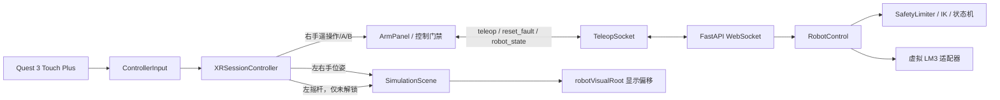

# Quest 3 遥操作可用性与故障复位设计

**日期：** 2026-07-19  
**范围：** Milestone 1 仿真遥操作可用性补强  
**目标设备：** Meta Quest 3 原厂 Touch Plus 手柄  
**运行形态：** 单一 WebSocket 控制端；PC 浏览器与 Quest 浏览器不可同时占用控制连接

## 1. 背景与目标

当前 Quest 3 实测暴露了四类问题：

1. PC 页面先连接后，Quest 页面会被后端的单控制端规则拒绝；前端没有解析拒绝原因，只显示笼统的“故障/失联”。
2. VR 中没有左右手柄的空间提示，用户难以确认手柄位置、朝向和追踪状态。
3. 虚拟机械臂操作台相对视点过低，不便于观察末端和工作空间。
4. 桌面鼠标控制触发工作空间越界后，故障仍被锁存，但界面又显示“等待解锁”，没有显式复位入口，只能通过刷新连接恢复。

本轮设计保持现有单控制端和安全边界，在不接入真机、不增加相机采集、不改变现有机器人坐标映射的前提下，完成：

- 明确区分“控制端被占用”“后端不可达”和“连接中断”；
- 在 VR 中显示左右 Touch Plus 手柄的轻量提示模型；
- 提供仅影响显示的操作台高度调节；
- 为可恢复的仿真安全故障增加显式、安全、无需刷新的复位流程。

## 2. 设计原则

### 2.1 单控制端不变

后端继续只允许一个 `/ws/teleop` 连接成为控制端。PC 页面、Quest 页面和其他浏览器标签页均采用先到先得，不增加观察端角色，也不广播高频机器人状态给额外客户端。

这样可避免额外连接和状态广播对控制链路带宽、时延和故障判定产生影响。用户从 PC 切换到 Quest 前，应关闭 PC 控制页面；关闭后 Quest 可通过低频重连获得连接。

### 2.2 显示变换与控制坐标分离

操作台高度只作用于 Three.js 场景的显示根节点，不修改：

- 后端机器人基坐标；
- VR 到机器人坐标的姿态映射；
- 工作空间边界；
- IK、限速和安全判定；
- 发往后端的目标位姿。

### 2.3 故障必须显式复位

安全故障停止后不自动清除，也不复用普通 `disarm` 的语义。客户端发送独立的 `reset_fault` 请求；后端只有在故障可恢复且控制输出已经停止时才接受。复位完成后仍保持 DISARMED，必须由用户重新按 A 解锁。

## 3. 单控制端占用提示

### 3.1 后端行为

后端保持现有互斥连接规则。第二个客户端连接时返回结构化拒绝消息，然后以现有占用关闭码结束连接：

```json
{
  "v": 1,
  "type": "connection_rejected",
  "reason": "controller_occupied",
  "message": "已有控制页面占用，请关闭电脑端网页后重试。"
}
```

`reason` 是客户端稳定判断依据，`message` 是可直接显示的中文回退文案。协议版本仍为 `v=1`，新增字段对旧客户端保持向后兼容。

### 3.2 前端连接状态

`TeleopSocket` 必须解析并保存最近一次 `connection_rejected`，不能把它折叠成普通断线。连接状态至少区分：

- `connected`：当前页面拥有控制连接；
- `occupied`：另一个页面拥有连接；
- `unreachable`：后端不可达或握手失败；
- `disconnected`：已建立的连接意外断开；
- `reconnecting`：等待下一次重连。

被占用时：

- PC HUD 与 VR 状态牌显示“控制端已被占用，请关闭电脑端网页后重试”；
- 所有解锁和运动输入保持禁用；
- Grip 必须视为松开，不缓存目标位姿；
- 使用低频退避重连，建议初始 2 秒，最大 5 秒；
- 连接恢复后保持 DISARMED，不自动解锁、不继承旧会话输入。

“请关闭电脑端网页”是面向当前 Quest 使用流程的明确提示。即使占用者实际是另一个 Quest 标签页，安全处置仍是关闭其他控制页面。

## 4. 左右手柄空间提示

### 4.1 输入读取

控制器输入层从每帧的 `XRSession.inputSources` 分别读取 `handedness=left` 和 `handedness=right` 的 `gripSpace` 位姿，并输出独立的追踪有效性、位置和四元数。

- 右手：继续提供 Grip、Trigger、A、B 和机器人遥操作位姿。
- 左手：本轮只提供可视化位姿，以及未解锁时的观察高度调节输入。
- 左手位姿不得进入机器人控制消息。

### 4.2 显示模型

不引入外部模型和新依赖，使用 Three.js 基础几何体生成轻量本地提示：

- 左手为紫灰色，带 `L` 标记；
- 右手为青色，带 `R` 标记；
- 两者带短方向轴或朝前指示，帮助判断手柄朝向；
- 模型尺寸接近手柄握持区域，但不追求 Touch Plus 外观复刻；
- 手柄追踪丢失时立即隐藏，恢复追踪后重新显示；
- 退出 XR 或销毁场景时释放几何体、材质和纹理。

手柄提示属于 XR 参考空间，不跟随操作台显示根节点移动。机器人目标标记仍独立显示，避免把“手柄当前位置”和“机器人目标”混淆。

## 5. 操作台观察高度调节

### 5.1 场景结构

在 `SimulationScene` 中引入可调显示根节点 `robotVisualRoot`，承载：

- 虚拟机械臂；
- 操作台/地台；
- 工作空间可视化；
- TCP 与机器人目标标记；
- 与机器人场景绑定的 VR 状态牌。

XR 相机、左右手柄提示和代表真实地面的网格不挂在该根节点下。根节点仅使用 Y 方向平移，不做缩放和旋转。桌面模式继续使用当前场景高度；进入 XR 后才施加观察高度，退出 XR 时恢复桌面显示高度。

目标标记仍以机器人局部坐标更新；显示时由 `robotVisualRoot` 统一施加高度偏移。所有从世界坐标换算到机器人局部坐标的代码必须显式处理该根节点，避免双重偏移。

### 5.2 默认高度与调节方式

- 每次进入 VR 后，等待第一帧有效头显位姿，以 `头显 Y - 0.72 m` 计算操作台台面基准高度，并限制在 `[0.55 m, 1.10 m]`。这兼容站立和坐姿，同时只计算显示偏移，不修改机器人控制坐标。
- 左手摇杆上下调节 `robotVisualRoot.position.y`。
- 建议速度为 `0.35 m/s`，死区为 `0.2`。
- 相对自动基准的手动偏移范围为 `[-0.6 m, +0.6 m]`，最终台面高度限制在 `[0.30 m, 1.40 m]`。
- 按下左手摇杆把手动偏移恢复为 `0`，即回到本次 XR 会话的自动基准高度。
- 只把手动偏移保存在浏览器 `localStorage`，建议键名 `vr4arm.xr.tableHeightOffsetM`；下次进入时根据新的头显高度重新计算基准，再叠加该偏移。

只有同时满足以下条件时允许调节：

1. XR 会话有效；
2. 左手柄追踪有效；
3. 当前不是 ARMING、ARMED、ACTIVE、FAULT 或 STALE；
4. 右手 Grip 已松开；
5. 没有未完成的解锁或故障复位请求。

调节被禁止时不累积摇杆输入。重新允许后，需要摇杆先回到死区，再次推动才继续调节，避免状态切换时突然移动场景。

VR 状态牌底部增加：

`左摇杆 ↑↓ 调节高度 · 按下恢复`

## 6. 可恢复故障复位

### 6.1 方案选择

采用独立 `reset_fault` 协议，而不采用以下方案：

- 复用 `disarm`：实现简单，但无法区分“停止”与“确认清除已锁存故障”；
- 停止完成后自动清故障：交互最少，但用户可能在未理解越界原因时立即再次解锁。

显式复位使用户动作、后端审查和 UI 反馈形成完整闭环。

### 6.2 协议

客户端请求：

```json
{
  "v": 1,
  "type": "reset_fault",
  "request_id": "client-generated-id"
}
```

成功响应：

```json
{
  "v": 1,
  "type": "fault_reset_result",
  "request_id": "client-generated-id",
  "accepted": true,
  "mode": "DISARMED"
}
```

拒绝响应：

```json
{
  "v": 1,
  "type": "fault_reset_result",
  "request_id": "client-generated-id",
  "accepted": false,
  "reason": "unrecoverable_fault",
  "message": "该故障无法在线复位，请重启后端并重新检查。"
}
```

必须回传 `request_id`，以便桌面按钮和 VR B 键共用同一套 pending/结果处理逻辑，并忽略过期响应。

### 6.3 可恢复范围

第一版允许在线复位的仿真命令/安全故障：

- `workspace_violation`；
- `ik_unreachable`；
- `ik_singular`；
- `joint_safety_window`。

以下故障不得在线复位：

- `control_loop_error` 或控制任务已经退出；
- 后端适配器初始化/关闭异常；
- 未知故障代码；
- 后续真实机械臂驱动报告的保护停机、急停或伺服故障。

不可恢复故障的 UI 必须提示重启后端并检查原因，不能引导用户反复按 B。

### 6.4 后端复位原子流程

收到请求后按顺序检查和处理：

1. 当前连接确实是唯一控制端；
2. 当前存在已锁存故障；
3. 故障代码位于可恢复白名单；
4. 控制循环仍存活；
5. 后端运动停止已经完成，且当前不在 ACTIVE/ARMING；
6. 再次调用或确认适配器停止，确保没有残留运动命令；
7. 清除映射锚点、目标位姿、插值/滤波状态、限速器运动历史和 pending completion；
8. 清除故障锁存，将状态机稳定设置为 DISARMED；
9. 广播新的 `robot_state`，再返回对应的复位结果。

任一步骤失败都保持故障锁存并返回拒绝，不允许出现“前端显示已复位、后端仍处于故障”的状态。

### 6.5 PC 与 VR 交互

PC 页面：

- 无故障时保留原“停止”按钮；
- 存在可恢复故障时按钮变为“复位故障”；
- 请求期间显示“复位中…”并禁用重复提交；
- 不可恢复故障时禁用复位并显示处置说明。

Quest 3：

- 无故障时 B 保持“停止并锁定”；
- 可恢复故障时，Grip 松开后按 B 发送一次 `reset_fault`；
- 长按 B 不重复发送，必须松开后再次按下；
- 请求期间显示“复位中…”；
- 成功后显示“已复位 · 按 A 重新解锁”；
- 不可恢复故障显示“无法在线复位 · 请重启后端”。

复位成功后必须重新满足 A 键的全部安全门禁。A/B/Grip 若仍保持按下，不产生新的边沿事件；必须全部松开后重新操作。

## 7. 状态显示优先级

HUD 与 VR 状态牌使用同一套状态派生逻辑，优先级由高到低为：

1. `occupied`；
2. `unreachable/disconnected/reconnecting`；
3. 不可恢复故障；
4. 可恢复故障或复位 pending；
5. STALE；
6. ARMING/ARMED/ACTIVE；
7. DISARMED/READY。

只要后端状态中仍有非空 `fault`，界面不得显示“等待解锁”或 READY。必须显示具体、可读的故障原因和下一步操作。

## 8. 组件职责与数据流



职责边界：

- `TeleopSocket`：协议解析、拒绝原因、重连状态和请求响应关联；
- `ControllerInput`：纯读取输入源、位姿、按钮与摇杆，不发送网络消息；
- `XRSessionController`：每会话边沿锁存、右手安全输入和左手观察输入门禁；
- `ArmPanel`：统一的解锁、停止、复位行为及只读安全状态；
- `SimulationScene`：手柄提示、显示根节点和高度持久化；
- `RobotControl`：故障分类、停止确认、复位原子流程与状态广播；
- `SafetyLimiter/Mapper`：提供明确的运动历史/锚点清理接口。

## 9. 测试与验收

### 9.1 自动化测试

后端至少覆盖：

- 第二连接收到 `controller_occupied` 后关闭；
- 可恢复故障停止完成后可以复位到 DISARMED；
- ACTIVE、停止未完成、无故障和不可恢复故障均拒绝复位；
- 复位清除 mapper、目标、滤波和限速状态；
- 复位后不会自动解锁或恢复旧目标；
- `request_id` 原样回传；
- 控制循环退出时拒绝在线复位。

前端至少覆盖：

- `connection_rejected` 不被折叠成普通断线；
- 占用、不可达、断开和故障文案按优先级显示；
- 左右输入源位姿独立读取，左手数据不进入遥操作帧；
- 手柄追踪丢失后模型隐藏，恢复后显示；
- 左摇杆只有在安全门禁满足时调节高度，并受死区、速度和范围限制；
- 高度偏移持久化与恢复默认；
- B 在普通状态发送 disarm，在可恢复故障状态发送 reset_fault；
- 复位 pending 防重复，成功后保持未解锁；
- fault 非空时不显示 READY/等待解锁。

### 9.2 桌面验收

1. 打开一个控制页面后再开第二页面，第二页面明确提示关闭其他页面；
2. 关闭第一个页面后，第二页面自动重连但保持未解锁；
3. 鼠标目标越过工作空间后进入故障并停止；
4. 点击“复位故障”后无需刷新即可回到未解锁；
5. 重新解锁时目标从新锚点开始，不发生跳变。

### 9.3 Quest 3 真机验收

1. PC 页面占用时，头显内明确提示“请关闭电脑端网页”；
2. 关闭 PC 页面后 Quest 自动恢复连接且不会自动运动；
3. 左右手柄提示位置、方向和 L/R 标识可辨认；
4. 手柄离开追踪区域时对应提示隐藏；
5. 未解锁时左摇杆可平滑调整操作台高度，按下恢复；
6. 已解锁或 Grip 按住时不能改变操作台高度；
7. 工作空间故障时显示“松开 Grip，按 B 复位”；
8. 复位后必须重新按 A 才能控制；
9. 断线、退出 VR、追踪丢失仍按现有规则立即停止。

Quest 真机清单完成前，不声明 Quest 端验收通过。

## 10. 非目标

- 不增加多观察端或多控制端；
- 不接入 LM3 真机；
- 不增加 MR/passthrough；
- 不增加相机、数据录制或跨设备时间同步实现；
- 不引入 Touch Plus 官方 3D 资产、WebXR Input Profiles 动态模型加载或新外部依赖；
- 不改变 Grip 移动、Trigger 夹爪、A 解锁的既有语义；
- 不允许真实机械臂保护停机通过通用 `reset_fault` 自动恢复。

## 11. 后续兼容性

本轮接口为后续相机与数据采集保留以下边界：

- 所有控制请求继续携带或可扩展单调时间戳与会话标识；
- 故障复位作为独立事件，未来可直接写入 episode 事件流；
- 显示高度偏移属于 UI 元数据，不进入机器人动作标签；
- 左右手原始位姿可以在未来采集层订阅，但本轮不存盘、不上传。
