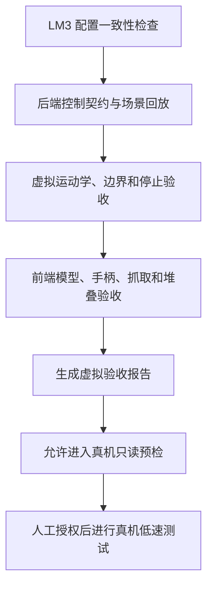

# 虚拟 LM3 实验室前置验收门禁设计

**日期：** 2026-07-26
**状态：** 待用户审查
**适用对象：** 乐白 LM3、原厂 LMG-90 夹爪、Meta Quest 3 原厂手柄、WebXR/FastAPI 遥操作链路

## 1. 目标

在不能连接真机时，充分利用当前与真机同型号、同夹爪配置的虚拟 LM3，建立一套可重复、可自动判定、不会误导真机安全决策的软件在环验收门禁。

该门禁必须做到：

1. 修复当前所有不依赖真机的失败测试，并重新建立全绿基线；
2. 使用同一套控制状态机、坐标映射、安全限制和消息协议测试虚拟与真实后端；
3. 使用确定性的 VR 输入场景验证跟手、姿态、夹爪、Home、边界退回、失联停止和故障恢复；
4. 验证虚拟机械臂的关节连续性、自碰撞代理、抓取、放置和堆叠；
5. 输出机器可读的验收报告，供后续实验记录和 Git 阶段冻结使用；
6. 明确区分“软件验收通过”和“真机验收通过”，虚拟测试不得自动授权真机运动。

## 2. 非目标

本阶段不实现或不宣称：

- 真实电机动力学、弹性、回差和制动距离仿真；
- LMG-90 的真实夹持力、摩擦、物体滑落和负载能力仿真；
- 真实急停按钮、安全回路或碰撞检测验证；
- 局域网抖动、Lebai 控制器调度延迟和 PVAT 实际跟随误差验证；
- 相机标定、视觉定位、VLA/ACT 数据采集；
- MuJoCo、Isaac Sim、Cannon-es、Rapier 等完整物理引擎接入；
- 根据虚拟测试结果自动把真机从 `readonly` 切换到 `control`。

## 3. 当前基线与问题分类

设计前复跑得到：

- 后端：324 项中 313 项通过，11 项失败；
- 前端：258 项中 253 项通过，5 项失败；
- 虚拟运动学、笛卡尔伺服、自碰撞专项：17/17 通过；
- 虚拟抓取、堆叠和模型专项：32/32 通过；
- 真机配置、Lebai 桥接、PVAT、日志专项：75/75 通过；
- 前端生产构建通过。

后端 11 项失败的根因：

1. 四项测试仍 monkeypatch 已被差分伺服替代的 `solve_ik` 入口；
2. 四项测试仍把 `ik_unreachable` 视为锁死硬故障，但当前产品设计已将其定义为可退回的软约束；
3. 十分钟 soak 场景仍注入 `ik_unreachable` 作为硬命令故障，导致恢复分支与当前语义不一致；
4. 一项安全测试隐含旧的 0.25 m 默认工作区，而正式默认值已经是 0.45 m；
5. `sim-reachability-v1.json` 由旧版 MDH 运动学生成，当前已经改为与 GLB 节点链一致的运动学，fixture 没有随模型重新生成。

前端五项失败均为测试期望对象未包含后来正式增加的 `grip`、`thumbstickX`、`headQ` 字段。

这些失败应通过修正测试入口、语义和旧 fixture 解决，不能删除安全断言，也不能为了全绿恢复已经废弃的生产代码。

## 4. 总体架构

验收分为四层：



门禁通过仅表示可以进入真机只读预检；不表示可以直接运动真机。

### 4.1 共享的逻辑，不强行共享未经验证的数值

虚拟后端与真实后端必须共享：

- `RobotControl` 状态机；
- WebSocket 消息协议；
- Quest 3 手柄坐标映射；
- 工作区投影、速度、加速度和单周期步长限制；
- Grip 释放停止、追踪丢失、页面隐藏、断连处理；
- Home 请求和阶段消息；
- 约束与故障语义；
- 记录接口。

以下数值在实验室确认前不能假装相同：

- 真机控制器当前 TCP；
- 真实 Home 关节角；
- 真机软关节上下限；
- LMG-90 开合幅值方向；
- 真机安全启动 TCP 包围盒。

因此保留两层配置：

1. **版本化仿真基线**：`config/lm3_visual_kinematics_v1.json`，包含 GLB 节点链、工具几何、仿真 Home、速度限制和碰撞代理；
2. **现场真机覆盖**：`real-robot.local.yaml`，包含从 L Master 和只读预检获取的 TCP、Home、软限位和夹爪幅值。

新增配置一致性检查器，把两者规范化为相同的 `RobotProfileSnapshot` 结构并生成差异报告。真机配置不存在时，仿真验收仍可运行；真机配置存在时，任何 Home、TCP、限位或夹爪方向差异都必须显式显示，不能静默覆盖。

### 4.2 双后端契约

现有后端接口继续作为统一边界：

- `preflight()`
- `command_tcp()`
- `set_gripper()`
- `stop()`
- `home()`
- `get_state()`

建立参数化的后端契约测试：

- `SimRobotAdapter`：运行真实虚拟运动学、关节积分和自碰撞代理；
- `RealLebaiAdapter + FakeLebaiBridge`：不导入、不连接真实 SDK，但验证 PVAT、状态读取、停止、Home 和夹爪命令的调用顺序及限幅。

同一条上层控制场景必须能够作用于两种后端。两种后端不比较逐帧关节角，而比较：

- 是否接受或拒绝同一类命令；
- 状态机是否按预期迁移；
- 是否在失联和硬故障时调用停止；
- 是否从未越过配置的速度、加速度、步长和关节软限位；
- Home 是否经历合法阶段并稳定结束；
- 是否没有 NaN、无穷值、队列堆积或重复停止。

## 5. 确定性场景回放

新增版本化场景集合和命令行验收入口。场景使用虚拟单调时钟，不依赖墙上时间，因此可以快速、可重复运行。

建议入口：

```text
python scripts/accept_virtual_lm3.py
python scripts/accept_virtual_lm3.py --json artifacts/acceptance/virtual-lm3.json
```

首版场景：

### 5.1 启动与零位锁定

1. 建立会话；
2. Grip 必须先松开；
3. 显式 Arm；
4. 捕获手柄零位与当前 TCP；
5. 零位锁定前移动手柄不得产生 TCP 命令；
6. 零位锁定后，手柄回到相同姿态时目标等于捕获 TCP。

### 5.2 六自由度跟手

分别输入：

- 前、后；
- 左、右；
- 上、下；
- roll、pitch、yaw。

验证末端目标方向符合操作者视角定义，位置与姿态响应连续，没有轴交换、符号反转或突跳。

### 5.3 人臂与机械臂幅度映射

验证：

- 平移缩放生效；
- 最大线速度、角速度生效；
- 最大线加速度、角加速度生效；
- 单周期最大 TCP 位移和转角生效；
- 长时间同方向移动不会因为单帧输入直接越过安全范围。

### 5.4 软约束与退回

覆盖：

- 工作区边界；
- 姿态边界；
- `ik_unreachable`；
- `ik_singular`；
- `joint_safety_window`；
- `self_collision`。

软约束出现时：

- 模式保持可操作；
- 保持最后安全目标；
- HUD/协议公布具体约束；
- 手柄向安全方向退回后自动清除；
- 不要求刷新页面或执行 Home。

若真实代码将某项定义为硬故障，测试必须显式说明原因，不能通过模糊的 `BackendCommandError` 自动决定。

### 5.5 夹爪、抓取与堆叠

使用五个 60 mm 彩色方块，验证：

- 夹爪只有在有效闭合边沿且方块位于捕获区域时抓取；
- 闭合后再靠近方块不会“吸附”；
- 抓取后方块跟随权威 `actual_tcp`，而不是未经执行的目标 TCP；
- 释放后方块位于桌面或最高有效支撑面；
- 两层和五层堆叠均无静态 AABB 穿透；
- Reset/Home 后方块和夹爪状态按设计复位。

该项是确定性运动学交互验收，不宣称验证真实摩擦和夹持力。

### 5.6 停止与恢复

覆盖：

- Grip 释放；
- WebXR tracking loss；
- 页面 `hidden` 和 `visible-blurred`；
- WebSocket 断开；
- 帧软超时和硬超时；
- 硬后端命令故障；
- Home；
- Home 超时；
- 停止失败升级。

每个停止事件必须验证：

- 控制门在同一控制周期内关闭；
- 停止调用次数准确；
- 未继续发送新运动命令；
- 用户可观察到中间状态；
- 恢复必须经过当前定义的显式释放、复位或重新 Arm 流程。

### 5.7 长时稳定性

修复现有十分钟 soak：

- `ik_unreachable` 用于软约束场景；
- 另用明确的硬错误代码注入命令故障；
- 每个仿真周期都必须执行，不能因为恢复分支漏计；
- 固定随机种子结果完全一致；
- 不同种子路径校验值不同；
- 30,000 个控制周期、30,000 个虚拟机器人周期；
- 无 NaN、无队列增长、无遗漏事件；
- 最终安全退出到 `DISARMED`。

## 6. 旧 IK Fixture 的处理

`sim-reachability-v1.json` 由旧版 MDH 模型生成，不能继续拿它验证当前 GLB 节点运动学。

处理方式：

1. 保留 `solve_ik` 作为离线批量 IK 诊断工具，不重新接入实时伺服链；
2. 修正 fixture 生成脚本，使其从仓库根目录之外运行时也能准确定位输出；
3. 用当前版本化 LM3 模型、固定随机种子和当前 Home 重新生成 fixture；
4. 在 fixture 元数据中记录模型配置版本或摘要；
5. 测试确认目标确实由当前 FK 生成，且离线 IK 成功率满足设计阈值；
6. 实时跟手仍由 `cartesian_servo_step` 验证，不能用离线 IK 的成功率替代实时连续性测试。

当前未提交的 `backend/app/sim/ik.py` 修改属于用户已有工作。实施时先保存其语义并单独验证，不直接覆盖；若新 fixture 仍暴露算法问题，再以单独测试证明并修复。

## 7. 验收报告

生成 JSON 报告，至少包含：

- Git commit 和工作区是否干净；
- 模型配置版本或摘要；
- 仿真/真实配置差异摘要；
- 后端、前端、构建测试数量；
- 每个场景的通过、失败、耗时；
- 最大 TCP/关节速度、加速度和单周期步长；
- 软约束触发与自动清除次数；
- 停止事件注入与确认次数；
- NaN、队列深度和遗漏周期；
- 抓取、释放、堆叠结果；
- `hardware_verified: false`；
- 尚需真机完成的检查清单。

报告默认写入被 Git 忽略的 `artifacts/acceptance/`。命令返回码：

- 全部软件门禁通过：`0`；
- 任一软件门禁失败：非 `0`；
- 没有真机配置不是软件门禁失败，但报告必须标记为未进行现场校准；
- 不允许使用 `skip` 把本应离线运行的测试伪装为通过。

## 8. 真机边界

虚拟门禁无法替代以下测试：

1. 真机 IP、SDK 鉴权和局域网连接；
2. `get_tcp()` 与原厂 LMG-90 TCP 的现场确认；
3. 真实 Home、软关节上下限和启动 TCP 包围盒；
4. LMG-90 幅值正反方向和最大安全夹持力；
5. PVAT 实际跟随误差、抖动和丢包表现；
6. `stop_move` 实际制动时间和制动距离；
7. 急停、安全回路及碰撞检测；
8. 实体方块尺寸、摩擦、滑落和负载；
9. 后续相机内外参、手眼关系和时间同步。

真机流程始终保持：

```text
虚拟门禁通过
→ LEBAI_READONLY 只读预检
→ 人工核对配置差异
→ 低速、单轴、最大 5 mm smoke
→ 显式批准后才进入遥操作
```

## 9. 实施顺序

1. 修复 16 项现有非真机失败，恢复全绿基线；
2. 建立后端契约测试和明确的软约束/硬故障分类；
3. 更新当前模型的可达性 fixture；
4. 建立版本化场景回放和十分钟 soak；
5. 建立虚拟/现场配置差异检查；
6. 建立前端手柄、模型、抓取和堆叠集成验收；
7. 生成统一 JSON 报告；
8. 跑完整后端、完整前端、构建和验收脚本；
9. 只提交本地 Git commit，不 push。

## 10. 完成标准

非真机部分只有同时满足以下条件才算完成：

- 后端全量测试零失败；
- 前端全量测试零失败；
- 前端生产构建成功；
- 十分钟确定性 soak 零错误；
- 虚拟验收场景全部通过；
- Fake Lebai 后端契约全部通过；
- 配置差异报告可在无真机配置和有现场配置两种情况下工作；
- 没有导入或连接真实 Lebai SDK；
- 没有真实机器人运动调用；
- 没有修改用户无关的未提交文件；
- 验收报告明确标记尚未完成真机验证；
- 所有结论均来自实际运行输出，不使用虚假的“预期通过”代替测试结果。
